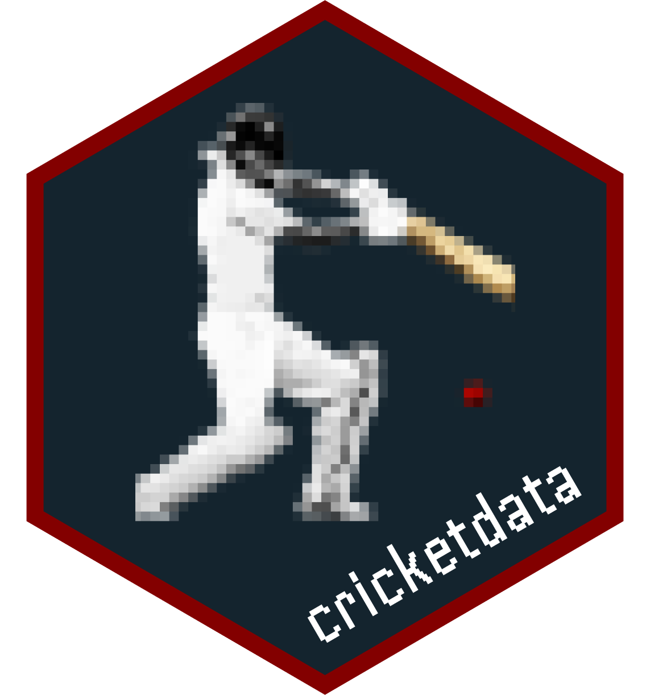

<!-- README.md is generated from README.Rmd. Please edit that file -->

```{r setup, include = FALSE}
knitr::opts_chunk$set(
  echo=TRUE,
  collapse = TRUE,
  comment = "#>",
  cache = TRUE,
  fig.path = "man/figures/README-"
)
library(cricketdata)
library(tidyverse)
```

# cricketdata 

<!-- badges: start -->
[](https://cran.r-project.org/package=cricketdata)
[](https://cran.r-project.org/package=cricketdata)
[](https://www.gnu.org/licenses/gpl-3.0.en.html)
[](https://github.com/robjhyndman/cricketdata/actions)
<!-- badges: end -->

Functions for downloading data on international and other major cricket matches from [ESPNCricinfo](https://www.espncricinfo.com) and [Cricsheet](https://cricsheet.org). This package provides some functions to download the data into tibbles ready for analysis.
  
Please respect the terms of use for each website: [ESPNCricinfo](https://www.espncricinfo.com/ci/content/site/company/terms_use.html), [Cricsheet](https://cricsheet.org/register/).

## Installation

You can install the **stable** version from [CRAN](https://cran.r-project.org/package=cricketdata).

```r
install.packages("cricketdata", dependencies = TRUE)
```

You can install the **development** version [Github](https://github.com/robjhyndman/cricketdata):

```{r gh-installation, eval = FALSE}
# install.packages("devtools")
devtools::install_github("robjhyndman/cricketdata")
```

## License

This package is free and open source software, licensed under GPL-3.
