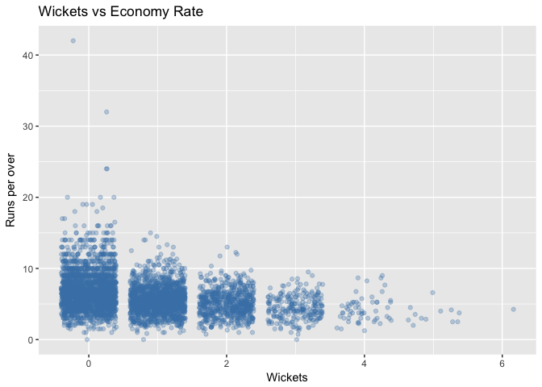
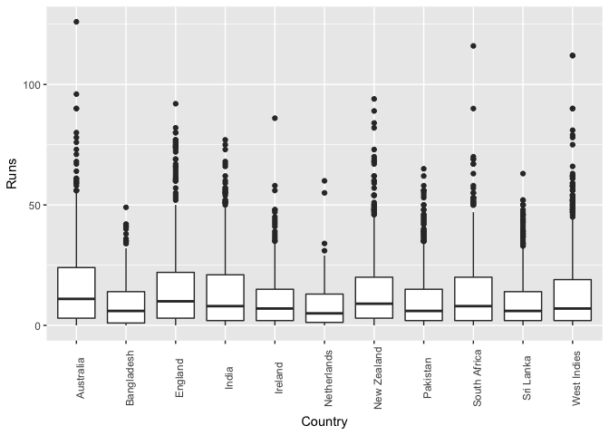

cricinfo
========

Functions for Downloading Cricket Data from ESPNCricinfo

Data on all international cricket matches is provided by ESPNCricinfo. This package provides some scraper functions to download the data into tibbles ready for analysis.

Please respect the [ESPNCricinfo terms of use](http://www.espncricinfo.com/ci/content/site/company/terms_use.html).

What does the data look like?
=============================

``` r
data("bowl_inn_data")
bowl_inn_data %>% 
  head() %>% 
  knitr::kable()
```

| Player                  |  Overs|  Mdns|  Runs|  Wkts|  Econ|  Inns| Opposition  | Ground        | Date       | Participation |
|:------------------------|------:|-----:|-----:|-----:|-----:|-----:|:------------|:--------------|:-----------|:--------------|
| AE Satterthwaite (NZ-W) |    4.0|     0|    17|     6|  4.25|     2| v ENG Women | Taunton       | 2007-08-16 | B             |
| S Luus (SA-W)           |    4.0|     0|     8|     5|  2.00|     2| v Ire Women | Chennai       | 2016-03-23 | B             |
| A Mohammed (WI-W)       |    4.0|     0|    10|     5|  2.50|     2| v SA Women  | Cape Town     | 2009-10-26 | B             |
| M Strano (AUS-W)        |    4.0|     0|    10|     5|  2.50|     1| v NZ Women  | Geelong       | 2017-02-19 | B             |
| A Shrubsole (ENG-W)     |    4.0|     0|    11|     5|  2.75|     1| v NZ Women  | Wellington    | 2012-02-17 | B             |
| J Goswami (IND-W)       |    3.5|     1|    11|     5|  2.86|     1| v AUS Women | Visakhapatnam | 2012-03-23 | B             |

Visualising player data
=======================

``` r
ElyssePerry <- fetch_player_data(275487, "T20")
MegLanning <- fetch_player_data(329336, "ODI")
SteveSmith <- fetch_player_data(267192, "Test")
ggplot(MegLanning) + geom_point(aes(x = Date, y = Score, col = NotOut)) +
ggtitle("Meg Lanning ODI Scores")
```

    ## Warning: Removed 63 rows containing missing values (geom_point).


Visualising the bowling data
============================

``` r
bowl_inn_data %>% 
  ggplot(aes(x = Wkts, y = Econ)) +
  geom_point(position = "jitter", alpha = 0.3, colour = "steelblue") +
  labs(title = "Wickets vs Economy Rate",
       x = "Wickets",
       y = "Runs per over")
```

    ## Warning: Removed 3798 rows containing missing values (geom_point).



Batting example
===============

``` r
data(WT20)

bat_data <- cricinfo:::clean_batting_data(WT20) 
bat_data %>% 
  head() %>% 
  knitr::kable()
```

| Date       | Player     | Country      |  Runs| NotOut | Participation |  Mins|  BallsFaced|  Fours|  Sixes|  StrikeRate|  Innings| Opposition   | Ground              |
|:-----------|:-----------|:-------------|-----:|:-------|:--------------|-----:|-----------:|------:|------:|-----------:|--------:|:-------------|:--------------------|
| 2014-03-27 | MM Lanning | Australia    |   126| TRUE   | B             |    67|          65|     18|      4|      193.84|        1| Ireland      | Sylhet              |
| 2010-10-14 | SA Fritz   | South Africa |   116| FALSE  | B             |    81|          71|     12|      2|      163.38|        1| Netherlands  | Potchefstroom (Uni) |
| 2010-05-05 | DJS Dottin | West Indies  |   112| FALSE  | B             |    40|          45|      7|      9|      248.88|        1| South Africa | Basseterre          |
| 2017-10-22 | DJS Dottin | West Indies  |   112| FALSE  | B             |    67|          67|      9|      5|      167.16|        1| Sri Lanka    | Coolidge            |
| 2005-09-02 | KL Rolton  | Australia    |    96| FALSE  | B             |    60|          53|     16|      1|      181.13|        2| England      | Taunton             |
| 2014-03-27 | SW Bates   | New Zealand  |    94| FALSE  | B             |    84|          61|      8|      2|      154.09|        1| Pakistan     | Sylhet              |

``` r
bat_data %>% 
  ggplot(aes(x = Country, y = Runs)) +
  geom_boxplot() +
  theme(axis.text.x = element_text(angle = 90)) +
  labs(title = "Runs per country")
```

    ## Warning: Removed 2421 rows containing non-finite values (stat_boxplot).


