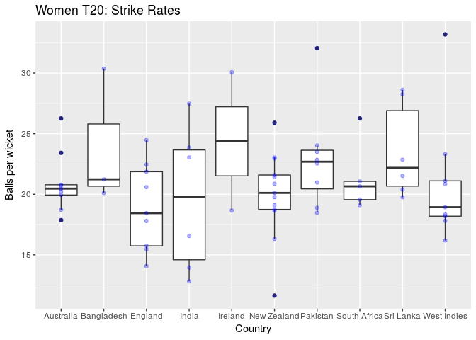
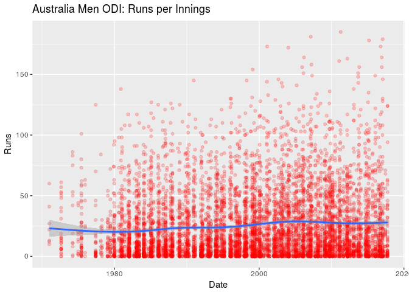
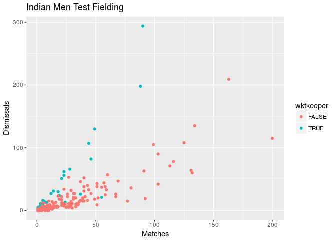

<!-- README.md is generated from README.Rmd. Please edit that file -->
cricinfo
========

Functions for Downloading Cricket Data from ESPNCricinfo

Data on all international cricket matches is provided by ESPNCricinfo. This package provides some scraper functions to download the data into tibbles ready for analysis.

Please respect the [ESPNCricinfo terms of use](http://www.espncricinfo.com/ci/content/site/company/terms_use.html).

Installation
------------

You can install cricinfo from github with:

``` r
# install.packages("devtools")
devtools::install_github("ropenscilabs/cricinfo")
```

Bowling Data
------------

``` r
# Fetch all Women's T20 data
wt20 <- fetch_cricinfo("T20", "Women", "Bowling")
wt20 %>% head %>% knitr::kable()
```

| Player      | Country     |  Start|   End|  Matches|  Innings|  Overs|  Maidens|  Runs|  Wickets|   Average|   Economy|  StrikeRate| BestBowlingInnings |  FourWickets|  FiveWickets|
|:------------|:------------|------:|-----:|--------:|--------:|------:|--------:|-----:|--------:|---------:|---------:|-----------:|:-------------------|------------:|------------:|
| A Mohammed  | West Indies |   2008|  2017|       92|       89|  314.3|        6|  1675|      106|  15.80189|  5.325914|    17.80189| 5/10               |            4|            2|
| EA Perry    | Australia   |   2008|  2016|       82|       78|  265.5|        4|  1513|       77|  19.64935|  5.691536|    20.71429| 4/12               |            2|            0|
| D Hazell    | England     |   2009|  2016|       70|       70|  266.0|        6|  1384|       73|  18.95890|  5.203008|    21.86301| 4/12               |            1|            0|
| SF Daley    | West Indies |   2009|  2014|       68|       67|  227.1|        8|  1113|       72|  15.45833|  4.899486|    18.93056| 5/15               |            2|            1|
| A Shrubsole | England     |   2008|  2016|       47|       47|  159.3|        5|   870|       68|  12.79412|  5.454546|    14.07353| 5/11               |            2|            1|
| SR Taylor   | West Indies |   2008|  2017|       80|       60|  206.1|        4|  1117|       68|  16.42647|  5.417947|    18.19118| 3/10               |            0|            0|

``` r
wt20 %>% 
  filter(Wickets > 20) %>%
  ggplot(aes(y = StrikeRate, x = Country)) +
  geom_boxplot() +
  geom_point(alpha=0.3, col="blue") +
  ggtitle("Women T20: Strike Rates") +
  ylab("Balls per wicket")
```



Batting Data
------------

``` r
# Fetch all Australian Men's ODI data by innings
menODI <- fetch_cricinfo("ODI", "Men", "Batting", type="innings", country="Australia")
menODI %>% head %>% knitr::kable()
```

| Date       | Player    |  Runs| NotOut |  Minutes|  BallsFaced|  Fours|  Sixes|  StrikeRate|  Innings| Participation | Opposition   | Ground    |
|:-----------|:----------|-----:|:-------|--------:|-----------:|------:|------:|-----------:|--------:|:--------------|:-------------|:----------|
| 2011-04-11 | SR Watson |   185| TRUE   |      113|          96|     15|     15|    192.7083|        2| B             | Bangladesh   | Dhaka     |
| 2007-02-20 | ML Hayden |   181| TRUE   |      227|         166|     11|     10|    109.0361|        1| B             | New Zealand  | Hamilton  |
| 2017-01-26 | DA Warner |   179| FALSE  |      186|         128|     19|      5|    139.8438|        1| B             | Pakistan     | Adelaide  |
| 2015-03-04 | DA Warner |   178| FALSE  |      164|         133|     19|      5|    133.8346|        1| B             | Afghanistan  | Perth     |
| 2001-02-09 | ME Waugh  |   173| FALSE  |      199|         148|     16|      3|    116.8919|        1| B             | West Indies  | Melbourne |
| 2016-10-12 | DA Warner |   173| FALSE  |      218|         136|     24|      0|    127.2059|        2| B             | South Africa | Cape Town |

``` r
menODI %>% 
  ggplot(aes(y = Runs, x = Date)) +
    geom_point(alpha=0.2, col='red') +
    geom_smooth() +
    ggtitle("Australia Men ODI: Runs per Innings")
```



Fielding Data
-------------

``` r
Indfielding <- fetch_cricinfo("Test", "Men", "Fielding", country="India")
Indfielding %>% head %>% knitr::kable()
```

| Player       |  Start|   End|  Matches|  Innings|  Dismissals|  Caught|  CaughtFielder|  CaughtBehind|  Stumped|  MaxDismissalsInnings|
|:-------------|------:|-----:|--------:|--------:|-----------:|-------:|--------------:|-------------:|--------:|---------------------:|
| MS Dhoni     |   2005|  2014|       90|      166|         294|     256|              0|           256|       38|                     6|
| R Dravid     |   1996|  2012|      163|      299|         209|     209|            209|             0|        0|                     3|
| SMH Kirmani  |   1976|  1986|       88|      151|         198|     160|              0|           160|       38|                     6|
| VVS Laxman   |   1996|  2012|      134|      248|         135|     135|            135|             0|        0|                     4|
| KS More      |   1986|  1993|       49|       90|         130|     110|              0|           110|       20|                     5|
| SR Tendulkar |   1989|  2013|      200|      366|         115|     115|            115|             0|        0|                     3|

``` r
wktkeeper <- (Indfielding$CaughtBehind > 0) | (Indfielding$Stumped > 0)
ggplot(Indfielding, aes(x=Matches, y=Dismissals, col=wktkeeper)) +
  geom_point() +
  ggtitle("Indian Men Test Fielding")
```



Individual player data
----------------------

``` r
MegLanning <- fetch_player(329336, "ODI")
MLave <- with(MegLanning, sum(Score, na.rm=TRUE) / (sum(is.na(Score)) - sum(NotOut)))
names(MLave) <- paste("Average =", round(MLave,2))
ggplot(MegLanning) + 
  geom_point(aes(x = Date, y = Score, col = NotOut)) +
  ggtitle("Meg Lanning ODI Scores") +
  geom_hline(aes(yintercept=MLave)) +
  scale_y_continuous(sec.axis = sec_axis(~ ., breaks=MLave))
```


