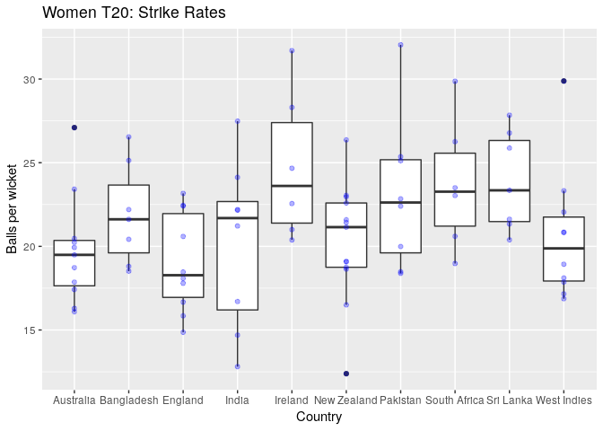
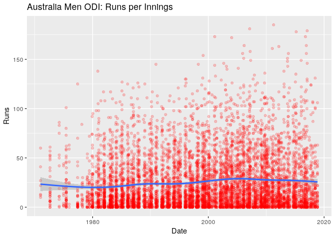
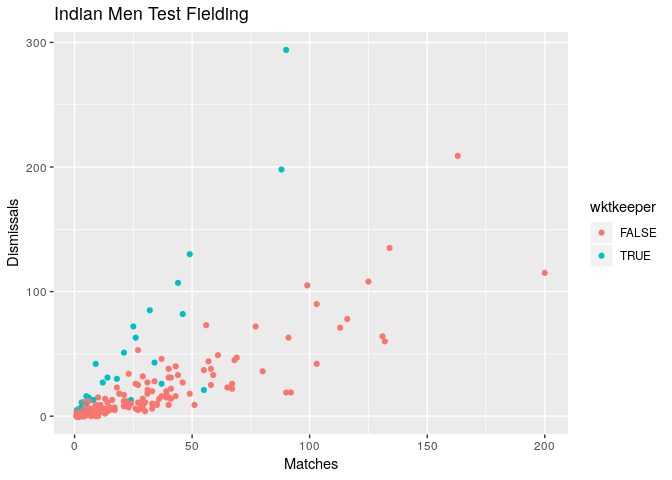
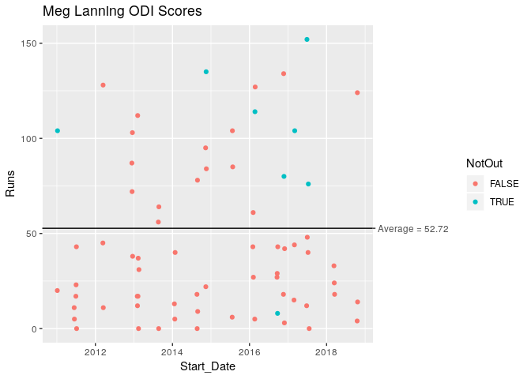

<!-- README.md is generated from README.Rmd. Please edit that file -->

# cricketdata

Functions for Downloading Cricket Data from ESPNCricinfo

Data on all international cricket matches is provided by ESPNCricinfo.
This package provides some scraper functions to download the data into
tibbles ready for analysis.

Please respect the [ESPNCricinfo terms of
use](http://www.espncricinfo.com/ci/content/site/company/terms_use.html).

## Installation

You can install cricketdata from github with:

``` r
# install.packages("devtools")
devtools::install_github("ropenscilabs/cricketdata")
```

## Bowling Data

``` r
# Fetch all Women's T20 data
wt20 <- fetch_cricinfo("T20", "Women", "Bowling")
wt20 %>% head() %>% knitr::kable()
```

| Player     | Country     | Start |  End | Matches | Innings | Overs | Maidens | Runs | Wickets |  Average |  Economy | StrikeRate | BestBowlingInnings | FourWickets | FiveWickets |
| :--------- | :---------- | ----: | ---: | ------: | ------: | ----: | ------: | ---: | ------: | -------: | -------: | ---------: | :----------------- | ----------: | ----------: |
| A Mohammed | West Indies |  2008 | 2018 |      99 |      95 | 336.3 |       6 | 1854 |     113 | 16.40708 | 5.509658 |   17.86726 | 5/10               |           4 |           3 |
| EA Perry   | Australia   |  2008 | 2018 |     102 |      98 | 324.5 |       6 | 1919 |     100 | 19.19000 | 5.907645 |   19.49000 | 4/12               |           3 |           0 |
| D Hazell   | England     |  2009 | 2018 |      85 |      85 | 317.3 |       6 | 1764 |      85 | 20.75294 | 5.555905 |   22.41176 | 4/12               |           1 |           0 |
| Nida Dar   | Pakistan    |  2010 | 2018 |      88 |      83 | 273.1 |       7 | 1374 |      82 | 16.75610 | 5.029896 |   19.98780 | 5/21               |           1 |           1 |
| SR Taylor  | West Indies |  2008 | 2018 |      93 |      73 | 247.3 |       4 | 1348 |      82 | 16.43902 | 5.446465 |   18.10976 | 4/12               |           1 |           0 |
| Sana Mir   | Pakistan    |  2009 | 2018 |      97 |      96 | 342.2 |       8 | 1850 |      81 | 22.83951 | 5.404090 |   25.35802 | 4/13               |           4 |           0 |

``` r

wt20 %>% 
  filter(
    Wickets > 20,
    !is.na(Country)
  ) %>%
  ggplot(aes(y = StrikeRate, x = Country)) +
    geom_boxplot() +
    geom_point(alpha=0.3, col="blue") +
    ggtitle("Women T20: Strike Rates") +
    ylab("Balls per wicket")
```

<!-- -->

## Batting Data

``` r
# Fetch all Australian Men's ODI data by innings
menODI <- fetch_cricinfo("ODI", "Men", "Batting", type="innings", country="Australia")
menODI %>% head() %>% knitr::kable()
```

| Date       | Player    | Runs | NotOut | Minutes | BallsFaced | Fours | Sixes | StrikeRate | Innings | Participation | Opposition   | Ground    |
| :--------- | :-------- | ---: | :----- | ------: | ---------: | ----: | ----: | ---------: | ------: | :------------ | :----------- | :-------- |
| 2011-04-11 | SR Watson |  185 | TRUE   |     113 |         96 |    15 |    15 |   192.7083 |       2 | B             | Bangladesh   | Dhaka     |
| 2007-02-20 | ML Hayden |  181 | TRUE   |     227 |        166 |    11 |    10 |   109.0361 |       1 | B             | New Zealand  | Hamilton  |
| 2017-01-26 | DA Warner |  179 | FALSE  |     186 |        128 |    19 |     5 |   139.8438 |       1 | B             | Pakistan     | Adelaide  |
| 2015-03-04 | DA Warner |  178 | FALSE  |     164 |        133 |    19 |     5 |   133.8346 |       1 | B             | Afghanistan  | Perth     |
| 2001-02-09 | ME Waugh  |  173 | FALSE  |     199 |        148 |    16 |     3 |   116.8919 |       1 | B             | West Indies  | Melbourne |
| 2016-10-12 | DA Warner |  173 | FALSE  |     218 |        136 |    24 |     0 |   127.2059 |       2 | B             | South Africa | Cape Town |

``` r

menODI %>% 
  ggplot(aes(y = Runs, x = Date)) +
    geom_point(alpha=0.2, col='red') +
    geom_smooth() +
    ggtitle("Australia Men ODI: Runs per Innings")
#> `geom_smooth()` using method = 'gam' and formula 'y ~ s(x, bs = "cs")'
#> Warning: Removed 2496 rows containing non-finite values (stat_smooth).
#> Warning: Removed 2496 rows containing missing values (geom_point).
```

<!-- -->

## Fielding Data

``` r
Indfielding <- fetch_cricinfo("Test", "Men", "Fielding", country="India")
Indfielding %>% head() %>% knitr::kable()
```

| Player       | Start |  End | Matches | Innings | Dismissals | Caught | CaughtFielder | CaughtBehind | Stumped | MaxDismissalsInnings |
| :----------- | ----: | ---: | ------: | ------: | ---------: | -----: | ------------: | -----------: | ------: | -------------------: |
| MS Dhoni     |  2005 | 2014 |      90 |     166 |        294 |    256 |             0 |          256 |      38 |                    6 |
| R Dravid     |  1996 | 2012 |     163 |     299 |        209 |    209 |           209 |            0 |       0 |                    3 |
| SMH Kirmani  |  1976 | 1986 |      88 |     151 |        198 |    160 |             0 |          160 |      38 |                    6 |
| VVS Laxman   |  1996 | 2012 |     134 |     248 |        135 |    135 |           135 |            0 |       0 |                    4 |
| KS More      |  1986 | 1993 |      49 |      90 |        130 |    110 |             0 |          110 |      20 |                    5 |
| SR Tendulkar |  1989 | 2013 |     200 |     366 |        115 |    115 |           115 |            0 |       0 |                    3 |

``` r

Indfielding %>%
  mutate(wktkeeper = (CaughtBehind > 0) | (Stumped > 0)) %>%
  ggplot(aes(x=Matches, y=Dismissals, col=wktkeeper)) +
    geom_point() +
    ggtitle("Indian Men Test Fielding")
```

<!-- -->

## Individual player data

``` r
MegLanning <- fetch_player_data(329336, "ODI") %>%
  mutate(NotOut = (Dismissal=="not out"))
MLave <- summarise(MegLanning,
    Innings = sum(!is.na(Runs)),
    Average = sum(Runs, na.rm=TRUE) / (Innings - sum(NotOut))
  ) %>%
  pull(Average)
names(MLave) <- paste("Average =", round(MLave,2))

ggplot(MegLanning) + 
  geom_point(aes(x = Start_Date, y = Runs, col = NotOut)) +
  ggtitle("Meg Lanning ODI Scores") +
  geom_hline(aes(yintercept=MLave)) +
  scale_y_continuous(sec.axis = sec_axis(~ ., breaks=MLave))
```

<!-- -->
