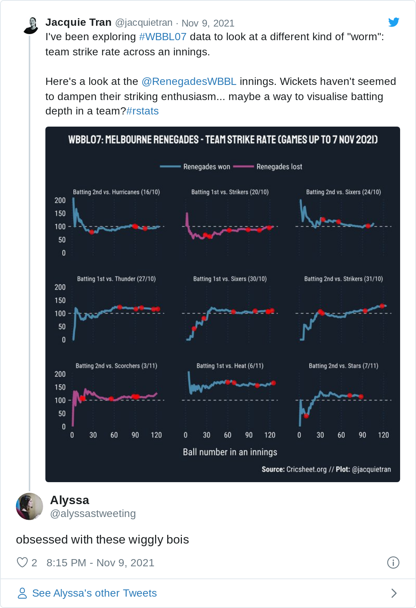

```{r, include = FALSE}
knitr::opts_chunk$set(
  collapse = TRUE,
  comment = "#>",
  echo = TRUE
)
```

```{r setup}
library(cricketdata)
library(readr)
library(dplyr)
library(stringr)
library(showtext)
library(ggplot2)
library(gghighlight)
library(ggtext)
library(patchwork)
```

The `fetch_cricsheet()` function will download csv data from [Cricsheet](https://cricsheet.org/downloads/). Data must be specified by three factors: (a) `type` of data: `bbb` (ball-by-ball), `match` or `player`; (b) `gender`; (c) `competition`.


Here are some examples of its use with some WBBL data. An earlier version of this article was published at https://underthehood.jacquietran.com/post/wbbl-visualisations/.

```{r getdata, eval=FALSE, echo=FALSE}
# Avoid downloading the data when the package is checked by CRAN.
# This only needs to be run once to store the data locally
wbbl_bbb <- fetch_cricsheet(competition = "wbbl", gender = "female")
wbbl_match_info <- fetch_cricsheet(competition = "wbbl", type = "match", gender = "female")
saveRDS(wbbl_bbb, "inst/extdata/wbbl_bbb.rds")
saveRDS(wbbl_match_info, "inst/extdata/wbbl_match_info.rds")
```

```{r loaddata, include=FALSE}
wbbl_bbb <- readRDS("../inst/extdata/wbbl_bbb.rds")
wbbl_match_info <- readRDS("../inst/extdata/wbbl_match_info.rds")
```

```r
# Fetch ball-by-ball data
wbbl_bbb <- fetch_cricsheet(competition = "wbbl", gender = "female")

# Fetch match metadata
wbbl_match_info <- fetch_cricsheet(competition = "wbbl", type = "match", gender = "female")
```

## Alyssa Healy's WBBL batting record

What is there to say about Alyssa Healy that hasn’t already been written by a far better writer than I? She’s a dangerous batter at every level she plays at, so I wanted to visualise her production across seasons, compared to other batters in the WBBL.

### Tidying the data

On exploring the Cricsheet data, I noticed that there are only 10 matches from WBBL01 with ball-by-ball data, but there were 59 matches played in the 1st season of WBBL (per [Wikipedia](https://en.wikipedia.org/wiki/2015%E2%80%9316_Women%27s_Big_Bash_League_season)).

Additionally, when I originally worked on this plot of Healy vs. the world, it was mid-October 2021 and the first ball of #WBBL07 had yet to be bowled. Now, we are reproducing the chart as we are part-way through the current season, so the code below also omits data from any matches played so far in this 7th season.

```{r}
# Data from 2015/16 (WBBL01) excluded due to only having 10 matches worth of data
# in the Cricsheet spreadsheet.
# Data from 2021/22 and later (WBBL07) excluded as incomplete at time of article
wbbl_bbb_tidy <- wbbl_bbb %>%
  filter(!season %in% c("2015/16", "2021/22")) %>%
  filter(start_date < "2021-11-07")
```

The ball-by-ball data hosted by Cricsheet provides a great starting point, but a little more tidying and wrangling is needed for the purposes of understanding batting performances across WBBL seasons.

In cricket broadcasts, batting average is among the most common statistic that commentators will reference to highlight how well a player performs with willow in hand. Batting average is calculated by taking runs scored by a batter over a defined period of time and dividing it by the number of they have been dismissed over that same period.

With this formula, the batting average metric can produce a somewhat inflated measure of a batter’s performance over time, because the denominator is dismissals and not total innings batted. On top of that, the WBBL season is relatively short - in season 7, there are 14 fixtured rounds, plus semi-finals and finals. So at maximum, a batter could play 16 innings in the current season. Others will bat far fewer innings than that hypothetical maximum, so 2 or 3 not-out innings can have a sizeable influence on batting average.

All things considered, including the T20 format of the WBBL, I was more interested in Healy’s “production” in the sense of average runs scored per innings.

```{r}
# Alyssa Healy compared to all players who have batted in 3+ innings in a season.
batting_per_season <- wbbl_bbb_tidy %>%
  group_by(season, striker) %>%
  summarise(
    innings_total = length(unique(match_id)),
    runs_off_bat_total = sum(runs_off_bat),
    balls_faced_total = length(ball),
    .groups = "keep"
  ) %>%
  mutate(
    runs_per_innings_avg = round(runs_off_bat_total / innings_total, 1),
    strike_rate = round(runs_off_bat_total / balls_faced_total * 100, 1)
  ) %>%
  filter(innings_total > 2) %>%
  mutate(is_healy = (striker == "AJ Healy")) %>%
  ungroup()
```

### Making a plot

```{r warning=FALSE, out.width="100%"}
# Import fonts from Google Fonts
font_add_google("Roboto Condensed", "roboto_con")
font_add_google("Staatliches", "staat")
showtext_auto()

# Build plot
batting_per_season %>%
  ggplot(aes(
    x = season, y = runs_per_innings_avg,
    group = striker, colour = is_healy
  )) +
  geom_line(linewidth = 2, colour = "#F80F61FF") +
  gghighlight(is_healy,
    label_key = striker,
    label_params = aes(
      size = 6, force_pull = 0.1, nudge_y = 10, label.size = 1,
      family = "roboto_con", label.padding = 0.5,
      fill = "#19232FFF",
      colour = "#F80F61FF"
    ),
    unhighlighted_params = list(size = 1, color = "#187999FF")
  ) +
  labs(
    title = "WBBL: Average runs scored per innings (3+ innings)",
    x = NULL, y = NULL,
    caption = "**Source:** Cricsheet.org // **Plot:** @jacquietran"
  ) +
  theme_minimal() +
  theme(
    text = element_text(size = 18, family = "roboto_con", colour = "#FFFFFF"),
    plot.title = element_text(family = "staat", margin = margin(0, 0, 15, 0)),
    plot.caption = element_markdown(size = NULL, margin = margin(15, 0, 0, 0)),
    axis.text = element_text(colour = "#FFFFFF"),
    legend.position = "none",
    panel.grid.major = element_line(linetype = "dashed"),
    panel.grid.minor = element_blank(),
    plot.background = element_rect(
      fill = "#171F2AFF", colour = NA
    ),
    panel.spacing = unit(2, "lines"),
    plot.margin = unit(c(0.5, 0.5, 0.5, 0.5), "cm")
  )
```

When plotting Healy’s WBBL production against the rest of the comp, what I see is “run machine” - consistent, high-end output over the last 5 WBBL seasons.

No hyperbole: there are few better than Alyssa Healy at the crease.

## Dismissals by ball number

Aside from scoring runs, another important aspect of batting is not losing your wicket. So how hard is it really to get the best batters out?

I would love to dive into this question using high-resolution data that reflects the biomechanics battle between bowlers and batters. Enter: Hawkeye…except that Hawkeye is only sporadically available for women’s matches, even at the highest level. As far as I know, there are no publicly available Hawkeye data sets from WBBL matches. If I’m wrong, please tell me and point me towards the good goods!

*([Cody Atkinson](https://twitter.com/CapitalCityCody/status/1448476292743983105) alerted me to the bounceR package by Richard Little, which enables access to Hawkeye data that does exist on the ICC and BCCI websites.)*

### Tidying the data

In the absence of fancy Hawkeye data from the WBBL, I took a simpler route through the Cricsheet ball-by-ball data to visualise how hard it is to take the wicket of the likes of Healy, Beth Mooney, Meg Lanning, Ellyse Perry, Sophie Devine, and Heather Knight.

```{r}
# Create new variable for ball number in each over
ball_number_faced <- wbbl_bbb_tidy %>%
  mutate(ball_num_in_over = sub(".*\\.", "", ball))

# Summarise number of balls faced of each ball number, per batter
ball_number_faced_summary <- ball_number_faced %>%
  group_by(ball_num_in_over, striker) %>%
  summarise(balls_faced = n(), .groups = "drop")

# Dismissals by ball number
dismissals_by_ball_number <- ball_number_faced %>%
  select(ball_num_in_over, striker, wicket_type) %>%
  filter(wicket_type != "") %>%
  group_by(ball_num_in_over, striker) %>%
  summarise(dismissals_n = n(), .groups = "drop")
```

The code above shapes up the ball-by-ball data to record:

 * How many balls a batter has faced at each ball number in an over (1-6),
 * How many times a batter has been dismissed at each ball number.

I made some editorial judgments too:

 * Excluded data from WBBL01 due to limited games from that season in the Cricsheet-hosted data
 * Excluded balls numbered 7+
 * League-wide data only includes batters who have faced 200+ balls total (across WBBL02-06, inclusive)

With the ball-by-ball data prepared for the analysis question, we can then calculate league-wide and player-specific summary statistics for dismissals by ball number:

```{r}
# Merge data and summarise to league-wide dismissals rate by ball number
dismissals_by_ball_number_summary <- left_join(
  ball_number_faced_summary, dismissals_by_ball_number,
  by = c("ball_num_in_over", "striker")
) %>%
  tidyr::replace_na(list(dismissals_n = 0)) %>%
  group_by(striker) %>%
  mutate(total_balls_faced = sum(balls_faced)) %>%
  ungroup() %>%
  mutate(dismissals_pct = round(dismissals_n / balls_faced * 100, 2)) %>%
  # Include those who have faced more than 200 balls total
  filter(total_balls_faced >= 200) %>%
  # Exclude balls beyond 6 - infrequent occurrences
  filter(ball_num_in_over < 7)

# Extract data for specific players
# Healy
dismissals_by_ball_number_summary_healy <- dismissals_by_ball_number_summary %>%
  filter(striker == "AJ Healy")
# Mooney
dismissals_by_ball_number_summary_mooney <- dismissals_by_ball_number_summary %>%
  filter(striker == "BL Mooney")
# Lanning
dismissals_by_ball_number_summary_lanning <- dismissals_by_ball_number_summary %>%
  filter(striker == "MM Lanning")
# Perry
dismissals_by_ball_number_summary_perry <- dismissals_by_ball_number_summary %>%
  filter(striker == "EA Perry")
# Devine
dismissals_by_ball_number_summary_devine <- dismissals_by_ball_number_summary %>%
  filter(striker == "SFM Devine")
# Knight
dismissals_by_ball_number_summary_knight <- dismissals_by_ball_number_summary %>%
  filter(striker == "HC Knight")
```

### Making plots

Here’s the code for building the plot I tweeted out. I decided to build one plot per player of interest and then “quilt” the plots together using the `patchwork` package (https://github.com/thomasp85/patchwork). I’m sure you could achieve the same / similar result using `ggplot2::facet_wrap()` but I just love using `patchwork` ...

```{r, out.width="100%"}
# Define consistent plot features ----------------------------------------------
plot_features <- list(
  coord_cartesian(ylim = c(0, 10)),
  theme_minimal(),
  theme(
    text = element_text(family = "roboto_con", colour = "#FFFFFF"),
    plot.title = element_text(
      size = 11, family = "staat", margin = margin(0, 0, 15, 0)
    ),
    plot.subtitle = element_text(
      size = 12, family = "staat", margin = margin(0, 0, 15, 0)
    ),
    plot.caption = element_markdown(
      size = 10, margin = margin(15, 0, 0, 0)
    ),
    axis.text = element_text(size = 9, colour = "#FFFFFF"),
    legend.position = "none",
    panel.grid.major.y = element_line(linetype = "dashed"),
    panel.grid.major.x = element_blank(),
    panel.grid.minor = element_blank(),
    plot.background = element_rect(
      fill = "#171F2AFF", colour = NA
    ),
    panel.spacing = unit(2, "lines"),
    plot.margin = unit(c(0.25, 0.25, 0.25, 0.25), "cm")
  ),
  labs(x = NULL, y = NULL)
)

# Build plots ------------------------------------------------------------------
showtext_auto()

# Healy
p1 <- dismissals_by_ball_number_summary %>%
  ggplot(aes(x = ball_num_in_over, y = dismissals_pct)) +
  geom_boxplot(
    fill = "#FFFFFF", colour = "#FFFFFF", size = .5,
    alpha = 0.25, notch = TRUE, outlier.shape = NA, coef = 0
  ) +
  geom_point(
    data = dismissals_by_ball_number_summary_healy,
    colour = "#F80F61FF", size = 3
  ) +
  labs(
    title = "WBBL: % dismissals by ball number",
    subtitle = "AJ Healy"
  ) +
  plot_features

# Mooney
p2 <- dismissals_by_ball_number_summary %>%
  ggplot(aes(x = ball_num_in_over, y = dismissals_pct)) +
  geom_boxplot(
    fill = "#FFFFFF", colour = "#FFFFFF", size = .5,
    alpha = 0.25, notch = TRUE, outlier.shape = NA, coef = 0
  ) +
  geom_point(
    data = dismissals_by_ball_number_summary_mooney,
    colour = "#FA6900FF", size = 3
  ) +
  labs(subtitle = "BL Mooney") +
  plot_features

# Lanning
p3 <- dismissals_by_ball_number_summary %>%
  ggplot(aes(x = ball_num_in_over, y = dismissals_pct)) +
  geom_boxplot(
    fill = "#FFFFFF", colour = "#FFFFFF", size = .5,
    alpha = 0.25, notch = TRUE, outlier.shape = NA, coef = 0
  ) +
  geom_point(
    data = dismissals_by_ball_number_summary_lanning,
    colour = "#018821FF", size = 3
  ) +
  labs(subtitle = "MM Lanning") +
  plot_features

# Perry
p4 <- dismissals_by_ball_number_summary %>%
  ggplot(aes(x = ball_num_in_over, y = dismissals_pct)) +
  geom_boxplot(
    fill = "#FFFFFF", colour = "#FFFFFF", size = .5,
    alpha = 0.25, notch = TRUE, outlier.shape = NA, coef = 0
  ) +
  geom_point(
    data = dismissals_by_ball_number_summary_perry,
    colour = "#F80F61FF", size = 3
  ) +
  labs(subtitle = "EA Perry") +
  plot_features

# Devine
p5 <- dismissals_by_ball_number_summary %>%
  ggplot(aes(x = ball_num_in_over, y = dismissals_pct)) +
  geom_boxplot(
    fill = "#FFFFFF", colour = "#FFFFFF", size = .5,
    alpha = 0.25, notch = TRUE, outlier.shape = NA, coef = 0
  ) +
  geom_point(
    data = dismissals_by_ball_number_summary_devine,
    colour = "#FA6900FF", size = 3
  ) +
  labs(subtitle = "SFM Devine") +
  plot_features

# Knight
p6 <- dismissals_by_ball_number_summary %>%
  ggplot(aes(x = ball_num_in_over, y = dismissals_pct)) +
  geom_boxplot(
    fill = "#FFFFFF", colour = "#FFFFFF", size = .5,
    alpha = 0.25, notch = TRUE, outlier.shape = NA, coef = 0
  ) +
  geom_point(
    data = dismissals_by_ball_number_summary_knight,
    colour = "#95C65CFF", size = 3
  ) +
  labs(
    subtitle = "HC Knight",
    caption = "**Source:** Cricsheet.org // **Plot:** @jacquietran"
  ) +
  plot_features

# Quilt the plots --------------------------------------------------------------
(p1 + p2 + p3) / (p4 + p5 + p6)
```

My key observations:

  1. Lanning doesn’t give much away on any ball number in an over - of balls faced at each ball number (1-6), her dismissals percentages range from 2.7-3.4%. Well under league medians of 4.3-5.1%.
  2. Perry is a stalwart too, but relative to her own standards, you might have a better shot bowling to her on balls 5 (2.7%) and 6 (3.4%) than earlier in an over (1.4-2.4%).
  3. Healy is obviously dangerous with how quickly she can accelerate her run-scoring, but is she susceptible on ball 5? (dismissed 7.1% out of balls faced vs. 4.7% as the league median for ball number 5)
  4. The opening partnership of Mooney / Devine is a scary prospect, reason #4182: they’re both hard to shift from the crease. Devine’s “worst” ball is ball number 3 (4.3%), Mooney’s is ball number 5 (4.5%) - both are still below league medians (4.8% and 4.7%, respectively).
  5. Knight is stubborn for balls 1-3 (1.7-2.8%), looser than the league medians for balls 4 and 5 (7.7% and 5.5%, respectively), then clamps down again for ball 6 (3.2%).

## “Wiggly bois”: Visualising team strike rates

Player and league summaries across seasons are great and all, but what really piques my interest with ball-by-ball / play-by-play data is using it to understand how matches unfold from moment to moment.

The very nature of cricket’s shortest format, T20, lends itself to batting aggression - recruiting for power hitters, aiming to demoralise the opposition by setting big targets, and building teams that bat deep. That last point is particularly important in T20 because aggressive batting means taking risks, and as long as there is risk taking by the batters, then the bowling side is in with a chance.

Commentators will generally focus on player strike rates in T20; that is, how many runs a batter scores for the number of balls faced. For instance, power hitters like Sophie Devine routinely achieve strike rates over 120 (i.e., 120 runs scored per 100 balls) - we can think of this as a measure of scoring efficiency.

A common perception is that snagging a wicket will slow down strike rates, but I wondered whether this is really true in the T20 context where the imperative to accelerate is paramount. Teams will also expect to lose some wickets in every innings, so I’d imagine they would recruit and train accordingly for a potent middle order and a tail that wags.

Instead of looking at player strike rates, what can we learn by analysing team *strike rates*?

### Tidying the data

For a more granular focus, I created a subset from the Cricsheet data that includes matches played in season 7 of the WBBL. At the time I produced my original visualisation, the ball-by-ball data included all games played up to 7 November 2021.

```{r}
# Subset match metadata for WBB07 games
wbbl07_match_info_tidy <- wbbl_match_info %>%
  filter(season == "2021/22", date <= "2021/11/07") %>%
  select(
    match_id, winner, winner_runs, winner_wickets, method, outcome,
    eliminator
  ) %>%
  mutate(match_id = factor(match_id))

# Subset ball-by-ball data for WBBL07 games
wbbl07_bbb_tidy <- wbbl_bbb %>%
  filter(match_id %in% wbbl07_match_info_tidy$match_id) %>%
  mutate(
    match_id = factor(match_id),
    runs_scored = runs_off_bat + extras,
    wicket_type = case_when(
      wicket_type == "" ~ NA_character_,
      TRUE ~ wicket_type
    )
  ) %>%
  group_by(match_id, innings) %>%
  mutate(
    temp_var = 1,
    balls_cumulative = cumsum(temp_var),
    runs_cumulative = cumsum(runs_scored),
    runs_total = max(runs_cumulative)
  ) %>%
  ungroup() %>%
  select(-temp_var) %>%
  # Merge match metadata and ball-by-ball data
  left_join(., wbbl07_match_info_tidy, by = "match_id") %>%
  mutate(
    outcome_batting_team = case_when(
      outcome %in% c("no result", "tie") ~ as.character(outcome),
      winner == batting_team ~ "won",
      TRUE ~ "lost"
    ),
    outcome_bowling_team = case_when(
      outcome %in% c("no result", "tie") ~ as.character(outcome),
      winner == bowling_team ~ "won",
      TRUE ~ "lost"
    )
  )
```

Using the WBBL07 data subset, I did some further tidying to calculate team strike rates per innings:

```{r}
team_strike_rate <- wbbl07_bbb_tidy %>%
  # Exclude matches that ended with a Super Over ("tie")
  # and matches that were called off ("no result")
  filter(!outcome_batting_team %in% c("tie", "no result")) %>%
  group_by(match_id, innings) %>%
  mutate(
    rolling_strike_rate = round(
      runs_cumulative / balls_cumulative * 100, 1
    ),
    wicket_ball_num = case_when(
      !is.na(wicket_type) ~ balls_cumulative,
      TRUE ~ NA_real_
    ),
    wicket_strike_rate = case_when(
      !is.na(wicket_type) ~ rolling_strike_rate,
      TRUE ~ NA_real_
    ),
    innings_description = case_when(
      innings == 1 ~ "Batting 1st",
      innings == 2 ~ "Batting 2nd"
    ),
    bowling_team_short = word(bowling_team, -1),
    start_date_day = lubridate::day(start_date),
    start_date_month = lubridate::month(start_date),
    match_details = glue::glue(
      "{innings_description} vs. {bowling_team_short} ({start_date_day}/{start_date_month})"
    )
  ) %>%
  arrange(match_id, innings, balls_cumulative) %>%
  mutate(
    match_details = factor(
      match_details,
      levels = unique(match_details)
    ),
    outcome_batting_team = factor(
      outcome_batting_team,
      levels = c("won", "lost")
    )
  )
```

### Making plots

There’s plenty that can be done with the `team_strike_rate` data which could warrant a dedicated exploration in itself. But I usually find that when I’m exploring a new analytical idea, it’s easier for me to get a feel for what the data does and or doesn’t highlight by going with a “small batch” approach.

With the Renegades at the top of the standings (as of 7 Nov), I focused on their team strike rates, a.k.a. *“wiggly bois”*:

```{r echo=FALSE, out.width="75%", fig.align="center"}

```

```{r, fig.width=9, fig.height=12, out.width="100%", warning=FALSE, message=FALSE}
# Filter to Renegades' innings only --------------------------------------------
team_strike_rate_renegades <- team_strike_rate %>%
  filter(str_detect(batting_team, "Renegades"))

# Build plot -------------------------------------------------------------------
showtext_auto()
team_strike_rate_renegades %>%
  ggplot(aes(x = balls_cumulative, y = rolling_strike_rate)) +
  facet_wrap(~match_details, ncol = 3) +
  geom_hline(yintercept = 100, linetype = "dashed", colour = "#CCCCCC") +
  geom_line(aes(colour = outcome_batting_team), linewidth = 1.5) +
  geom_point(
    aes(
      x = team_strike_rate_renegades$wicket_ball_num,
      y = team_strike_rate_renegades$wicket_strike_rate
    ),
    colour = "red", size = 3, alpha = 0.75
  ) +
  labs(
    title = "WBBL07: Melbourne Renegades - Team strike rate (games up to 7 Nov 2021)",
    x = "Ball number in an innings", y = NULL,
    caption = "**Source:** Cricsheet.org // **Plot:** @jacquietran"
  ) +
  scale_x_continuous(breaks = seq(0, 120, by = 30)) +
  scale_color_manual(
    values = c("won" = "#4a8bad", "lost" = "#AD4A8B"),
    labels = c("Renegades won", "Renegades lost")
  ) +
  coord_cartesian(ylim = c(0, 200)) +
  theme_minimal() +
  theme(
    text = element_text(size = 18, family = "roboto_con", colour = "#FFFFFF"),
    legend.position = "top",
    legend.title = element_blank(),
    legend.key.size = unit(1.5, "cm"),
    legend.margin = margin(0, 0, 0, 0),
    legend.spacing.x = unit(0, "cm"),
    legend.spacing.y = unit(0, "cm"),
    plot.title = element_text(family = "staat", margin = margin(0, 0, 15, 0)),
    plot.caption = element_markdown(size = NULL, margin = margin(15, 0, 0, 0)),
    strip.text = element_text(colour = "#FFFFFF", size = 12),
    axis.text = element_text(colour = "#FFFFFF"),
    axis.title.x = element_text(margin = margin(15, 0, 0, 0)),
    panel.grid.major.y = element_blank(),
    panel.grid.minor.y = element_blank(),
    panel.grid.major.x = element_line(colour = "#203b60", linetype = "dotted"),
    panel.grid.minor.x = element_blank(),
    plot.background = element_rect(
      fill = "#171F2AFF",
      colour = NA
    ),
    panel.spacing = unit(2, "lines"),
    plot.margin = unit(c(0.5, 0.5, 0.5, 0.5), "cm")
  )
```

The plots show the Renegades’ team strike rate across each innings they’ve batted, with wicket occurrences overlaid. From a visual assessment, it looks like wickets have not dampened the enthusiasm of Renegades’ batters for striking the ball - broadly speaking, it appears that, when the new batter comes in for the Renegades, they are often able to maintain the team’s strike rate. In some games, they’ve even managed to accelerate after losing a wicket.

Importantly, the Renegades have not lost many wickets in Powerplay overs this season, which puts them in a better position to push the scoring pace as an innings wears on with most of their wickets in hand.
